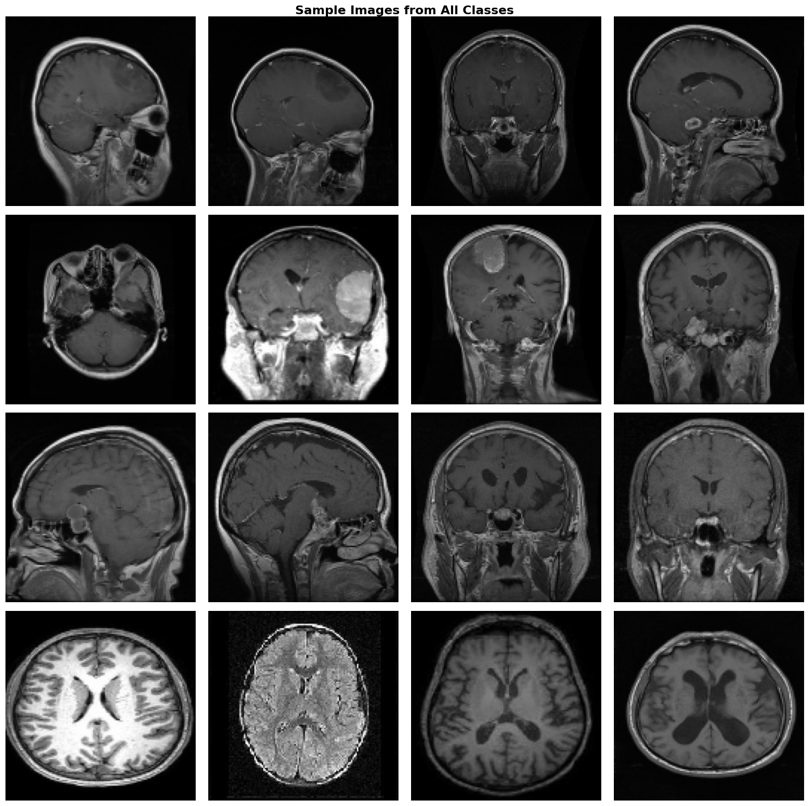
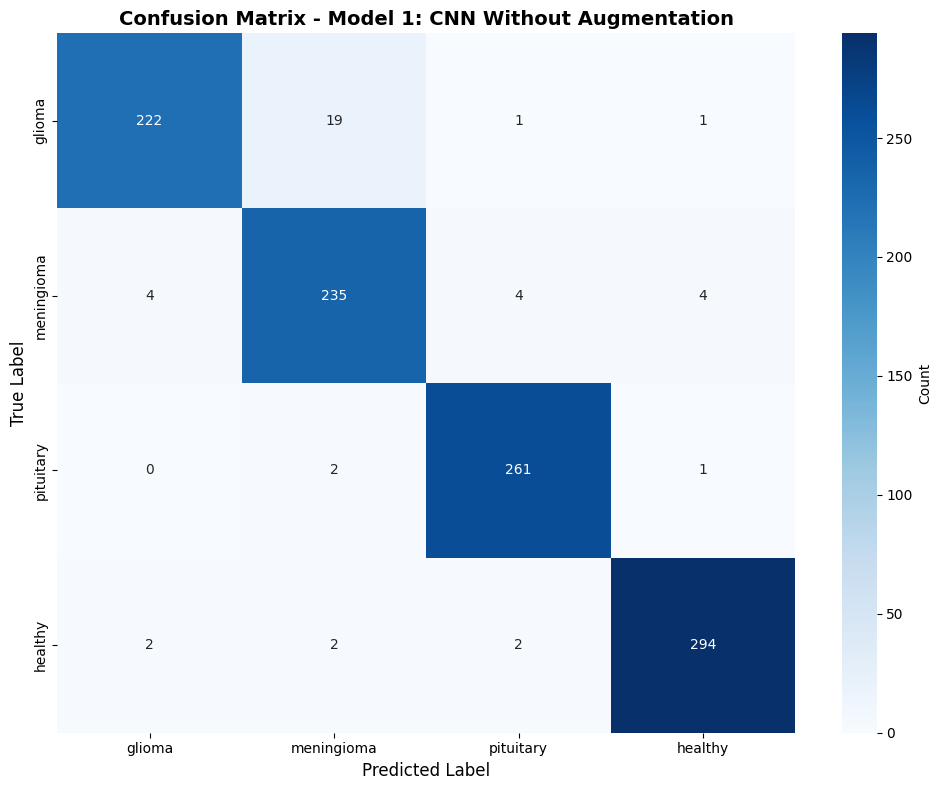
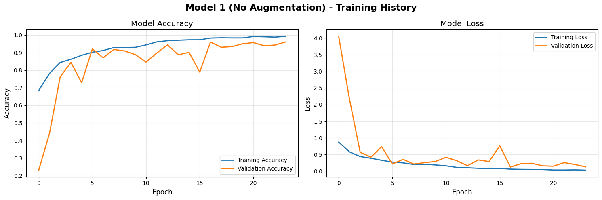
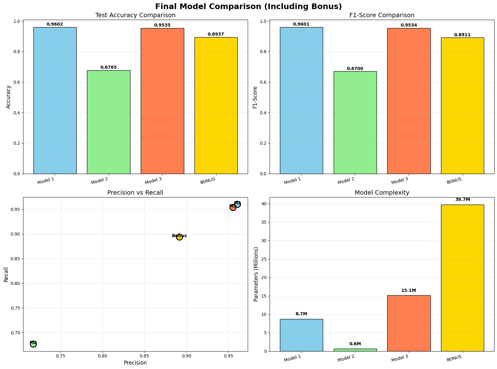

# Brain Tumor MRI Classification

Deep learning models that classify brain MRI scans into four categories — **glioma, meningioma, pituitary tumor, and healthy** — to support faster, more consistent screening. Four architectures were built and compared, from a hand-crafted CNN to a VGG16 + ResNet50 hybrid ensemble, with the best model reaching **96% test accuracy**.

> **Author:** Abdalla Ebrahim — Computer Engineering student, AASTMT.
> Academic project, for educational purposes only. This is **not** a medical device and is not intended for clinical diagnosis.

---

## Overview

**What it does.** Given a brain MRI image, the model predicts which of four classes it belongs to: glioma, meningioma, pituitary tumor, or no tumor (healthy).

**Why.** Reading MRI scans by hand is time-consuming and can vary from one reader to another. An automated classifier can act as a fast "second opinion" that flags a likely tumor type for a radiologist to review. The aim of this project is to explore how well standard deep-learning approaches handle this task, and which design choices actually matter.

The project trains **four different models**, runs controlled experiments on the main training settings, and evaluates every model with a held-out test set, confusion matrices, and 5-fold cross-validation.

---

## Dataset

- **Source:** [Brain Tumor MRI Scans (Kaggle)](https://www.kaggle.com/datasets/rm1000/brain-tumor-mri-scans)
- **Size:** 7,023 images across 4 roughly balanced classes
- **Image format:** 128 × 128 × 3 (RGB)
- **Split:** 70% train (4,916) / 15% validation (1,053) / 15% test (1,054)

| Class | Images |
|---|---|
| Glioma | 1,621 |
| Meningioma | 1,645 |
| Pituitary | 1,757 |
| Healthy | 2,000 |

> The dataset is **not** included in this repository. Download it from the Kaggle link above and point the notebook's `data_dir` at the extracted folder (see [How to run](#how-to-run)).



---

## Models

| # | Model | Parameters | Test Accuracy | F1-Score |
|---|---|---|---|---|
| 1 | **Baseline CNN** (no augmentation) | 8.7M | **96.02%** | **0.9601** |
| 2 | Enhanced CNN (with augmentation) | 0.6M | 67.65% | 0.6700 |
| 3 | Transfer Learning (VGG16) | 15.1M | 95.35% | 0.9534 |
| 4 | Hybrid Ensemble (VGG16 + ResNet50) | 39.7M | 89.37% | 0.8911 |

**Champion model: the hand-crafted baseline CNN**, at 96.02% test accuracy — which notably beat the 39.7M-parameter hybrid ensemble. A useful reminder that more parameters do not automatically mean better results.

### Key features
- Custom CNN built from scratch (Conv / BatchNorm / MaxPool / Dropout blocks)
- Transfer learning with pre-trained **VGG16** and **ResNet50**
- A **hybrid ensemble** that concatenates VGG16 and ResNet50 features into a single classifier
- Enhanced CNN using separable convolutions, global average pooling, and residual-style skip connections
- Regularization throughout: batch normalization, dropout, early stopping, and learning-rate reduction on plateau
- Controlled experiments on **batch size**, **learning rate**, **early stopping**, and **number of epochs**

---

## Results

The best model separates the four tumor types cleanly, with most errors limited to a handful of glioma / meningioma mix-ups:



Training was stable, with a small gap between the training and validation curves (a sign of good generalization):



All four models side by side — accuracy, F1-score, precision vs. recall, and parameter count:



**A note on data augmentation.** In this setup, augmentation actually *reduced* performance — the augmented model fell to ~68% accuracy and was unstable across cross-validation folds. The lesson isn't "augmentation is bad," but that it has to be tuned to the data and verified empirically, not assumed to help.

---

## Tech stack

- **Language:** Python 3.12
- **Deep learning:** TensorFlow / Keras
- **Computer vision:** OpenCV, Pillow
- **ML utilities:** scikit-learn (train/test split, K-fold cross-validation, metrics)
- **Data & plotting:** NumPy, pandas, Matplotlib, seaborn
- **Model storage:** h5py
- **Environment:** Jupyter Notebook

---

## How to run

> The notebook is configured to run on **CPU** (no GPU required). Training all four models takes a while on CPU — if you just want to see the results, open the notebook, since all outputs and charts are already saved inside it.

1. **Get the code** — clone or download this repository.
2. **Get the data** — download the dataset from [Kaggle](https://www.kaggle.com/datasets/rm1000/brain-tumor-mri-scans) and extract it. The extracted folder should contain four subfolders: `glioma`, `meningioma`, `pituitary`, `healthy`.
3. **Install the dependencies:**
   ```bash
   pip install tensorflow opencv-python scikit-learn numpy pandas matplotlib seaborn pillow h5py jupyter psutil
   ```
4. **Point the notebook at your data** — open `brain_tumor_classification.ipynb` and set:
   ```python
   data_dir = r'PATH_TO_YOUR_DATASET_FOLDER'
   ```
   to the folder you extracted in step 2.
5. **Run it** — launch Jupyter and run the cells from top to bottom:
   ```bash
   jupyter notebook
   ```

---

## What I learned

- **Transfer learning** — how to reuse pre-trained VGG16 / ResNet50 feature extractors, which reached ~95% accuracy with far less design effort than building from scratch.
- **Complexity isn't free performance** — the smallest, simplest baseline CNN outperformed a 39.7M-parameter hybrid ensemble. Bigger models are not automatically better.
- **Augmentation must be validated** — aggressive data augmentation dropped accuracy from 96% to ~68% and made validation unstable, teaching me to test augmentation empirically rather than assume it helps.
- **Honest evaluation** — judging models on a held-out test set, confusion matrices, and precision / recall / F1, and using 5-fold cross-validation to measure how *stable* each model really is, not just its best-case accuracy.
- **Diagnosing overfitting** — reading the gap between training and validation curves and controlling it with dropout, batch normalization, and early stopping.
- **Preparing code for public release** — before publishing, I audited the project to remove hardcoded local file paths and my machine username (an information-disclosure issue), and deliberately kept the large trained-model files and the dataset out of version control. Small but important habits for anyone sharing code publicly.

---

## Repository contents

- `brain_tumor_classification.ipynb` — the full notebook: data loading, all four models, the experiments, cross-validation, and evaluation (with saved outputs).
- `Images/` — the charts and figures used in this README.

---

## License

Released under the [MIT License](LICENSE).
